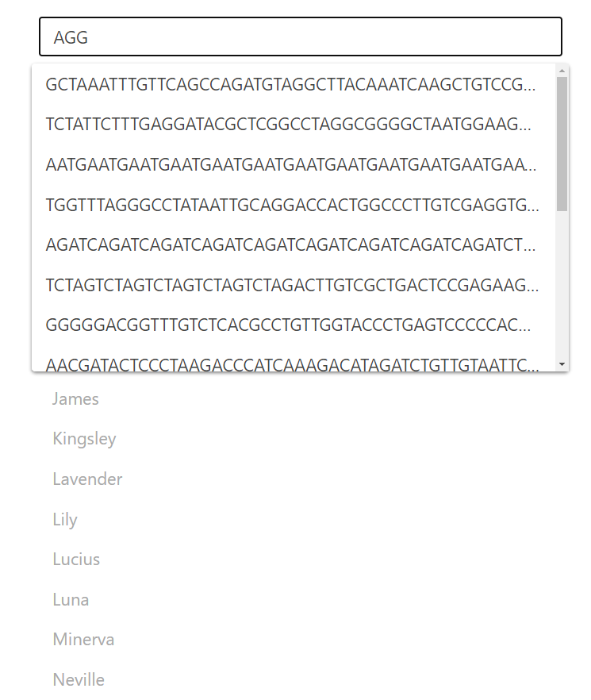

# Nifty-Web-Apps
Nifty web apps is a project to bring clean and simple web applications to school projects with console output. After students complete their programming assignments, students can interact with their code using a web application instead of the boring console.  

### Our paper on the web apps: https://dl.acm.org/doi/10.1145/3408877.3432580

### Example web apps:  
### Search Engine
  

### DNA Strand

